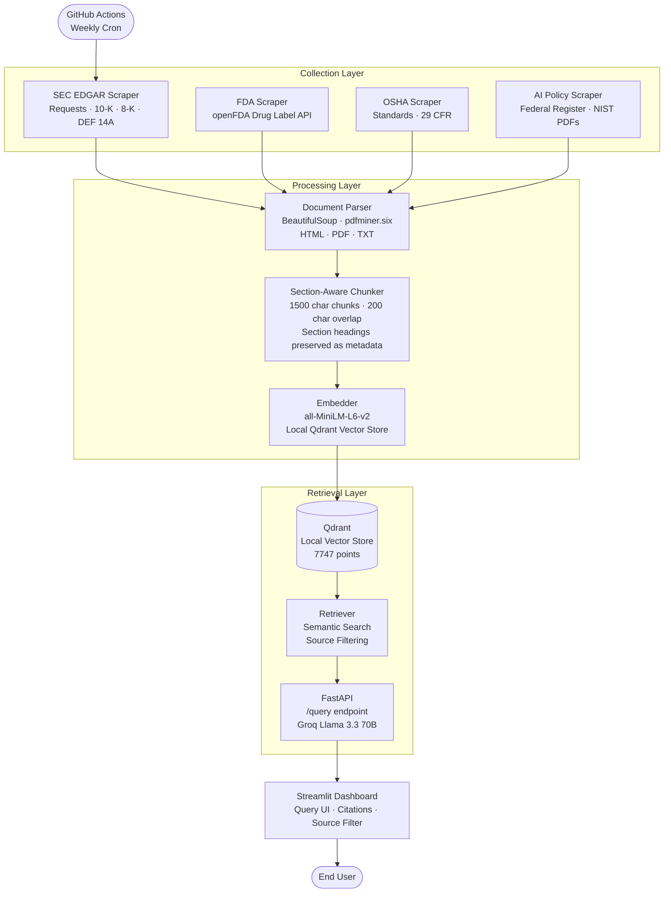
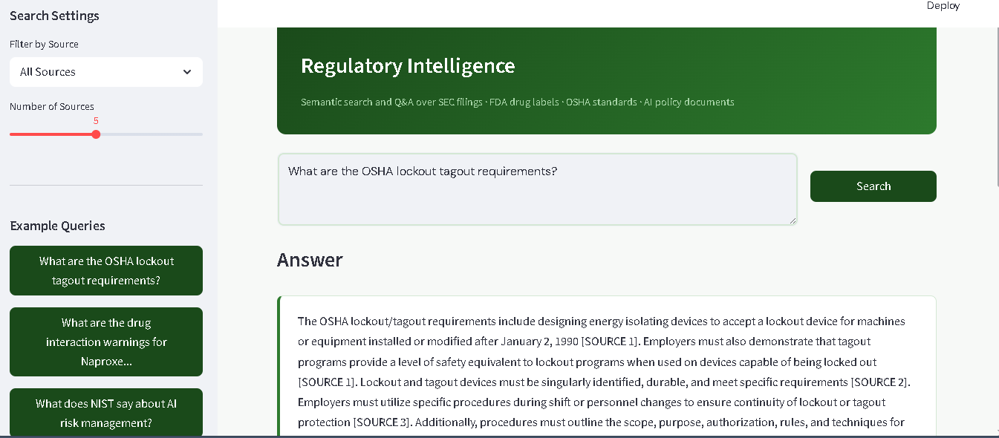

# Regulatory RAG Pipeline


> An end-to-end RAG pipeline that scrapes, parses, chunks, embeds, and makes queryable 137 regulatory documents across SEC EDGAR, FDA drug labels, OSHA workplace safety standards, and US AI policy — with a FastAPI query endpoint, Streamlit dashboard, Docker deployment, and weekly GitHub Actions automation.

**[Live Dashboard →](regulatory-rag-pipeline/dashboard/app.py)** &nbsp;|&nbsp; **[API Usage →](#api-usage)**

---

## The Business Problem

Compliance teams, legal analysts, and risk managers spend hours manually searching across SEC filings, FDA guidance, OSHA standards, and AI policy documents to answer specific regulatory questions. These documents are dense, frequently updated, and spread across dozens of government websites with no unified search interface.

This pipeline automates the entire workflow: it scrapes regulatory documents from four authoritative sources, builds a semantic search index, and delivers grounded, cited answers in seconds — with every response traceable to its exact source document and section. The result is a compliance research tool that reduces hours of manual document review to a single query.

---

## Architecture



---

## Evaluation Results

Evaluated on 10 curated test cases covering all 4 regulatory domains:

| Metric | Score |
|---|---|
| Source Accuracy (top-1 from correct domain) | **100%** |
| Keyword Hit Rate (keyword in top-5) | **100%** |
| Average Top-1 Cosine Similarity | **0.6627** |
| Average Query Latency (after warmup) | **~105ms** |

Latency on first query is higher (~15s) due to model loading into memory. All subsequent queries in the same session average 105ms.

---

## Dataset

| Source | Documents | Chunks | Content |
|---|---|---|---|
| SEC EDGAR | 45 | ~8,000 | 10-K annual reports, 8-K current reports, DEF 14A proxy statements |
| FDA Drug Labels | 40 | ~1,200 | Warnings, contraindications, drug interactions, dosage |
| OSHA Standards | 8 | ~230 | 29 CFR workplace safety regulations |
| AI Policy | 44 | ~1,400 | Federal Register AI rules, NIST AI RMF, Generative AI Profile |
| **Total** | **137** | **~7,747** | |

---

## Tech Stack

| Component | Technology | Purpose |
|---|---|---|
| SEC Collection | requests + EDGAR API | 10-K, 8-K, DEF 14A filings |
| FDA Collection | openFDA Drug Label API | Drug warnings and regulatory content |
| OSHA Collection | requests | 29 CFR workplace safety standards |
| AI Policy Collection | Federal Register API + NIST | AI governance documents and PDFs |
| HTML Parsing | BeautifulSoup + lxml | Clean text extraction with boilerplate removal |
| PDF Parsing | pdfminer.six | Text extraction with layout awareness |
| Chunking | Custom section-aware splitter | 1500-char chunks with 200-char overlap |
| Embedding | all-MiniLM-L6-v2 | Local inference, 384 dimensions |
| Vector Store | Qdrant (local) | Semantic search with metadata filtering |
| LLM Synthesis | Groq · Llama 3.3 70B | Grounded answer generation with citations |
| API | FastAPI | REST query endpoint |
| Dashboard | Streamlit | Query UI with source citations |
| Containerisation | Docker + Docker Compose | API + dashboard as isolated services |
| Scheduling | GitHub Actions (weekly cron) | Automated re-scrape and re-embed |

---

## Setup Instructions

### Prerequisites

- Python 3.12+ (local) or Docker (containerised)
- A Groq API key (free) — [console.groq.com](https://console.groq.com)

---

### Option A — Local Setup

**1. Clone and install:**
```bash
git clone https://github.com/nurudeenaminu/regulatory-rag-pipeline.git
cd regulatory-rag-pipeline

python -m venv .venv

# Windows PowerShell
.venv\Scripts\Activate.ps1

# macOS / Linux
source .venv/bin/activate

pip install -r requirements.txt
```

**2. Configure environment:**

Create a `.env` file in the project root:
```env
GROQ_API_KEY=your_groq_api_key_here
QDRANT_COLLECTION_NAME=regulatory_docs
SEC_USER_AGENT=Your Name your@email.com
```

SEC EDGAR requires a `User-Agent` header with your name and email — no signup needed.

**3. Run the pipeline:**
```bash
python main.py
```

Runtime is 30-60 minutes on first run (dominated by CPU embedding). Subsequent runs skip already-processed files.

**4. Start the API:**
```bash
uvicorn api.app:app --port 8000
```

**5. Launch the dashboard:**
```bash
streamlit run dashboard/app.py
```

Opens at `http://localhost:8501`.

**6. Run evaluation:**
```bash
python evaluate.py
```

---

### Option B — Docker

**1. Configure environment** (same `.env` as above)

**2. Build and run:**
```bash
docker-compose up --build
```

Services:
- API: `http://localhost:8000`
- Dashboard: `http://localhost:8501`

**3. Run the pipeline inside Docker:**
```bash
docker-compose exec api python main.py
```

---

### GitHub Actions — Automated Weekly Run

Add these secrets to your GitHub repo (Settings → Secrets → Actions):

| Secret Name | Value |
|---|---|
| `GROQ_API_KEY` | Your Groq API key |
| `SEC_USER_AGENT` | `Your Name your@email.com` |

The workflow at `.github/workflows/pipeline.yml` runs every Monday at 06:00 UTC. Trigger manually from the Actions tab using **Run workflow**.

---

## API Usage

```bash
curl -X POST http://localhost:8000/query \
  -H "Content-Type: application/json" \
  -d '{"query": "What are the OSHA lockout tagout requirements?", "top_k": 5}'
```

**Response:**
```json
{
  "query": "What are the OSHA lockout tagout requirements?",
  "answer": "The OSHA lockout/tagout requirements include designing energy isolating devices to accept a lockout device after January 2, 1990 [SOURCE 1]. Employers must also demonstrate that tagout programs provide a level of safety equivalent to lockout programs [SOURCE 1]...",
  "citations": [
    {
      "document_name": "29_CFR_1910.147",
      "source": "OSHA_STANDARDS",
      "section": "By Standard Number",
      "score": 0.6771,
      "text_snippet": "..."
    }
  ],
  "model": "llama-3.3-70b-versatile"
}
```

**Optional source filter:**
```bash
-d '{"query": "drug interaction warnings", "source_filter": "FDA_DRUG_LABELS"}'
```

Valid source filters: `SEC_EDGAR`, `FDA_DRUG_LABELS`, `OSHA_STANDARDS`, `FEDERAL_REGISTER`, `NIST`

**Health check:**
```bash
curl http://localhost:8000/health
```

---

## Project Structure

```
regulatory-rag-pipeline/
├── main.py                      # Pipeline orchestrator
├── evaluate.py                  # Retrieval quality evaluation
├── Dockerfile                   # Container definition
├── docker-compose.yml           # Multi-service orchestration
├── scrapers/
│   ├── sec_scraper.py           # SEC EDGAR collection
│   ├── fda_scraper.py           # FDA drug label collection
│   ├── osha_scraper.py          # OSHA standards collection
│   └── eu_ai_act_scraper.py     # AI policy collection
├── parser/
│   └── document_parser.py       # HTML/PDF/TXT → clean text
├── chunker/
│   └── section_chunker.py       # Section-aware chunking
├── embedder/
│   └── embedder.py              # Embedding + Qdrant upsert
├── retriever/
│   └── retriever.py             # Semantic search
├── api/
│   └── app.py                   # FastAPI query endpoint
├── dashboard/
│   └── app.py                   # Streamlit dashboard
├── data/
│   ├── raw/                     # Scraped documents
│   ├── parsed/                  # Clean text output
│   ├── chunks/                  # Chunked documents
│   └── qdrant_local/            # Local vector store
├── logs/
│   └── pipeline.log
├── .github/
│   └── workflows/
│       └── pipeline.yml         # Weekly cron automation
├── requirements.txt
├── .env                         # Never commit
└── README.md
```

---

## Production Considerations

### Scaling the embedding pipeline

CPU embedding at 14,000+ chunks takes 30-60 minutes. For production scale, switch to GPU inference or a managed embedding API. The embedder is modular — swap the model in one line in `embedder/embedder.py`.

### Proxy rotation for scraping

At current scale (137 documents), direct scraping works without proxies. At 10x volume, rotating residential proxies (BrightData, Oxylabs) become necessary. The scrapers use a configurable `USER_AGENT` and request delay that can be extended to a proxy pool.

### Moving to Qdrant Cloud

The local Qdrant store works for single-machine deployment. For multi-user or cloud deployment, replace `QdrantClient(path=...)` with `QdrantClient(url=..., api_key=...)` in both `embedder/embedder.py` and `retriever/retriever.py`.

### CRM and compliance platform integration

The FastAPI `/query` endpoint is the natural integration point for downstream systems. Connecting to a compliance platform, internal wiki, or Slack bot requires only an HTTP client pointed at the endpoint — no changes to the pipeline.

---

## Screenshots

### Dashboard



---

## License

MIT